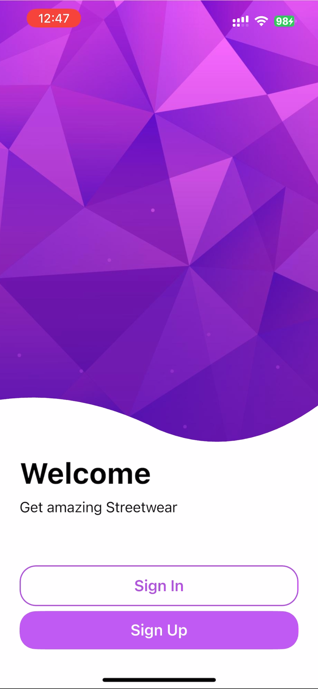
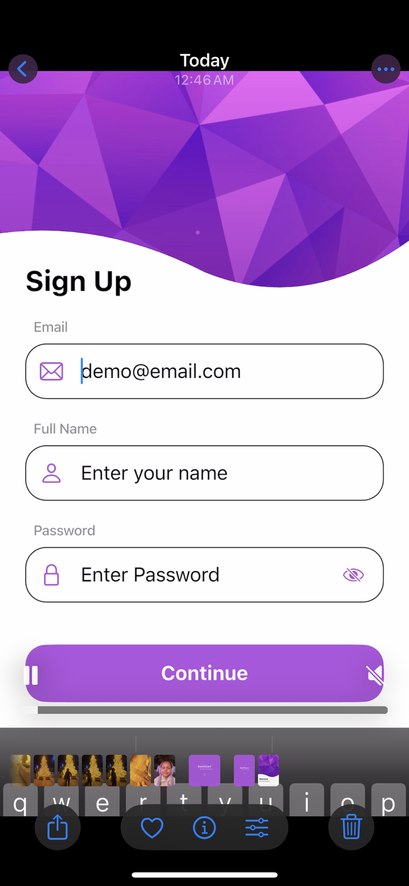
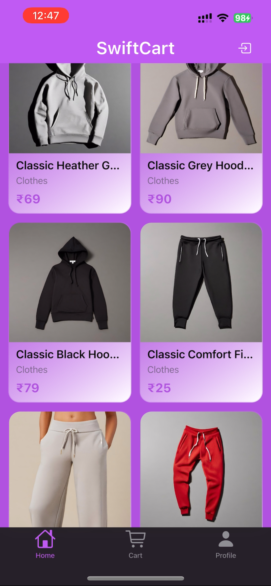
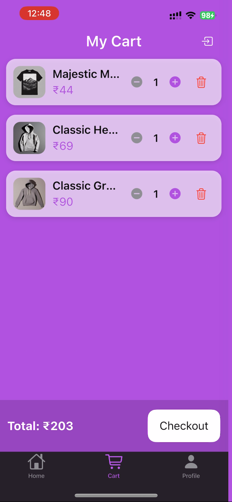
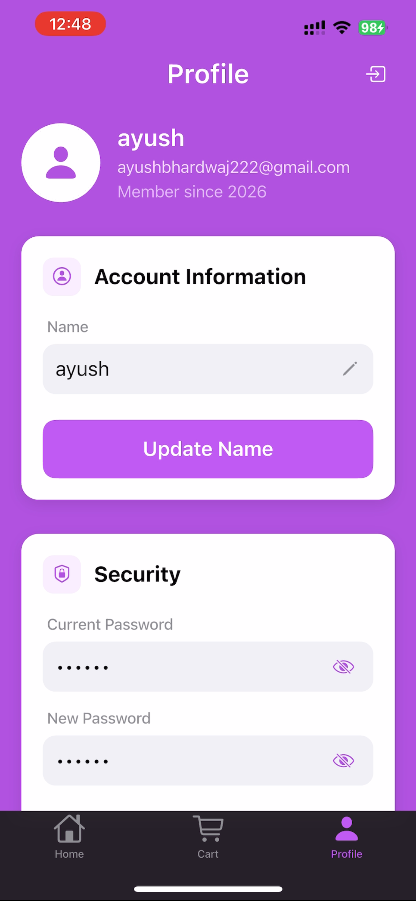

# SwiftCart — iOS-Styled Flutter Shopping App

SwiftCart is a Flutter e-commerce application designed with an **iOS-native Cupertino UI**, built using **GetX state management** and an **MVVM-inspired architecture**.

The application supports:

- Firebase-based user authentication (Register, Login, Profile)
- Product listing via the **Platzi Fake Store REST API**
- Add-to-cart & cart total calculation
- Profile update & secure session handling
- Reactive UI using GetX Observables
- iOS-styled navigation using `CupertinoTabScaffold`

---

## 🚀 Tech Stack & Project Details

| Component | Stack |
|--------|------|
| Flutter Version | **Flutter 3.x.x (Latest Stable)** |
| Dart Version | **3.x.x** |
| State Management | **GetX** |
| Architecture Pattern | **MVVM (Modular, Layered, Controller + Repo)** |
| Backend Auth | **Firebase Authentication** |
| Remote API | **Platzi Fake Store API** |
| UI Theme | **Cupertino (iOS-Style)** |
| Navigation | **GetX Navigation + Cupertino Tabs** |

---

## 🎥 Demo Video

The full working demo has been shared securely via Google Drive, along with the Firebase configuration file.

👉 **Access Demo Video & Firebase Config Folder**  
https://drive.google.com/drive/folders/1RVx3op7zFMhM_FyebM6oIUSNzB_AMW-u?usp=drive_link

---

## 🔐 Firebase Configuration

Firebase is used for:

- User Registration  
- Login Authentication  
- Profile Updates  
- Session Handling  

The Firebase configuration file (`GoogleService-Info.plist`) is **not pushed to the repository** for security reasons.  
It is included in the Google Drive folder linked above.

### 🛠 How to Configure Firebase (iOS) using `GoogleService-Info.plist`

1. Download the file from the Drive folder:
2. Place it inside the iOS Runner project:
3. Open `ios/Runner.xcodeproj` in Xcode.
4. Ensure the file is **added to the Runner target**:
- Select Runner → Build Phases → Copy Bundle Resources  
- Confirm `GoogleService-Info.plist` is listed

5. Add Firebase Core dependency in `pubspec.yaml` (already included, verify):
 firebase_core:
firebase_auth:

6. Run the following commands:
flutter clean
flutter pub get
cd ios
pod install
cd ..
flutter run

Status:

- No build errors  
- Firebase auth functional  
- API works correctly  
- Cart logic validated  
- Navigation stable across tabs  
- Tested on real iOS device  

---

## 🛍 Product API — Platzi Fake Store

SwiftCart uses the following public API for product listing:

> Platzi Fake Store API — mock commerce REST API for prototyping

Data is consumed via:

- Repository Layer  
- Dashboard & Product Controllers  
- GetX Reactive Streams  
- Clean UI Binding  

---

## 🖼 Screenshots

Screenshots are stored in:

| Splash | Welcome |
|------|------|
|  |  |

| Sign Up | Sign In |
|------|------|
|  |  |

| Product List | Cart |
|------|------|
|  |  |

| Profile |
|------|
|  |

---

## 🏗 Project Folder Structure (MVVM + GetX)

**Layers Breakdown**

- `model/` — Data models  
- `data/remote/` — API + Firebase repos  
- `screens/*/controller` — View Logic (GetX)  
- `screens/*/view` — UI Pages  
- `widgets/` — Reusable UI Components  

---

## ⚙️ Setup & Run The Project

Install dependencies:

---

## 🍏 iOS Setup Notes

Place Firebase plist file:

---

## 📌 Additional Notes

- Firebase credentials & demo video are stored securely outside the repository  
- Repository contains **only required source files**  
- Screenshots provided for UI demonstration  
- Project structure follows **scalable modular pattern**

---

## 👤 Author

**Ayush Bhardwaj**  
GitHub: https://github.com/bhardwajexploit

---

## ⭐ If you like this project

Consider starring the repository. Feedback is welcome.

